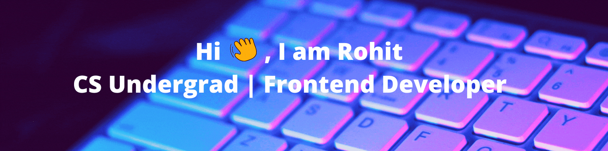

<h3>Glad to see you here!!🙋‍♂️</h3>

I am currently in Third Year of Computer Engineering 🎓 from Pune University 🏛. I'm a passionate learner who's always willing to learn and work across technologies and domains 💡. I love to explore new technologies and leverage them to solve real-life problems ✨. Apart from that I also love to guide and mentor newbies 👨🏻‍💻.

<h4>Languages & Tools</h4>

             

<h4>Connect with me:</h4>

   

